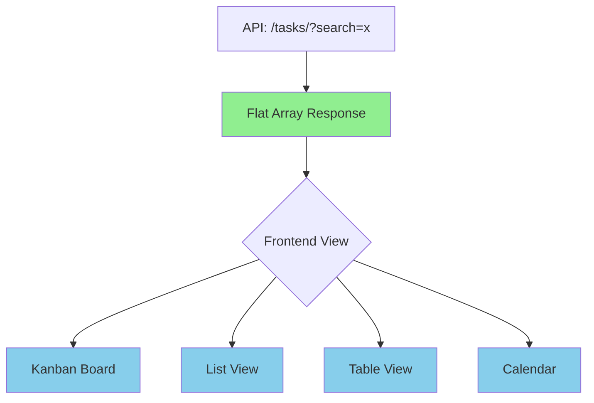

This is an excellent architectural question. Let me analyze both approaches:

## Comparison: Flat Array vs Grouped by Status

### 1. Flat Array (Current Approach)

**Backend returns:**
```json
[
  { "id": 1, "title": "Task", "status": "TODO" },
  { "id": 2, "title": "Task", "status": "DONE" }
]
```

**Frontend groups:**
```javascript
tasksData = {
  TODO: flatTasks.filter(t => t.status === 'TODO'),
  IN_PROGRESS: flatTasks.filter(t => t.status === 'IN_PROGRESS'),
  DONE: flatTasks.filter(t => t.status === 'DONE'),
};
```

### 2. Grouped by Status (Alternative)

**Backend returns:**
```json
{
  "TODO": [...],
  "IN_PROGRESS": [...],
  "DONE": [...]
}
```

---

## Analysis by Factor

| Factor | Flat Array | Grouped by Status |
|--------|-----------|-------------------|
| **Performance** | ✅ Same | ✅ Same (same data) |
| **Code Maintainability** | ✅ More flexible | ❌ Less flexible |
| **Frontend Complexity** | ⚠️ Slight overhead | ✅ Simpler |
| **Reusability** | ✅ Can reuse for non-Kanban | ❌ Kanban-specific |
| **Scalability** | ✅ No issues | ✅ No issues |

---

## Recommendation: **Flat Array**

### Reasons:

1. **Reusability**: A flat array can be used by multiple UI components (Kanban, list view, table view, calendar). Grouped data is specific to Kanban.

2. **Frontend Complexity**: The grouping is a simple `filter()` operation - negligible performance cost for typical board sizes (100s of tasks).

3. **API Consistency**: One endpoint (`/tasks/`) works for all use cases. You don't need separate endpoints (`/tasks/grouped/` vs `/tasks/flat/`).

4. **Separation of Concerns**: Backend handles data/storage, frontend handles presentation. Grouping is a presentation concern.

5. **Scalability**: Even with 10,000 tasks, the `filter()` operation is trivial (microseconds). The real bottleneck is network transfer, which is identical.

### When Grouped Makes Sense:

- Very large datasets where frontend filtering is expensive (but then use **pagination** instead)
- Very simple apps that will never need other views
- When the backend already stores data in a grouped format

---

## Summary

**Stick with the flat array approach** - it's the industry standard for REST APIs. The frontend grouping code you have now is correct and adds minimal complexity while providing maximum flexibility.



The flat array is the **single source of truth** that can power multiple views - that's better architecture.